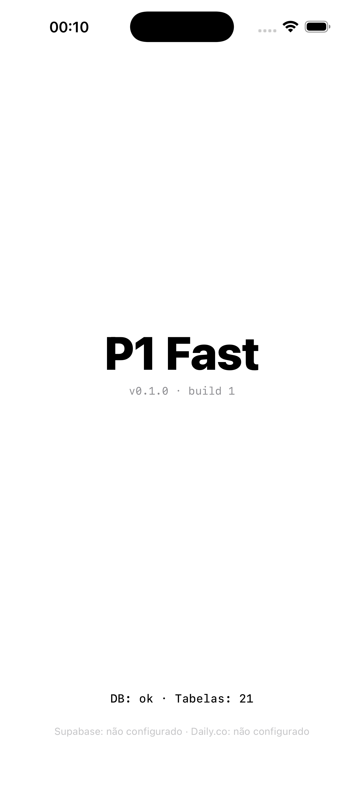

# `ios/` — código Swift do P1 Fast

Tudo que vai pro celular vive aqui. Conforme [ADR-018](../ARCHITECTURE_DECISIONS.md), o app do celular é **iOS nativo Swift, sem PWA**, e o motivo central é captura IMU @ 10 Hz consistentes (impossível garantir no Safari).

## Subpastas

### `p1fast-ios/` — app SwiftUI real
Skeleton SwiftUI mínimo que roda no simulator/iPhone. Importa `p1fast-core` (path local) + GRDB.swift + daily-client-ios + supabase-swift via SPM. Boots o `DatabaseQueue` do core na inicialização e mostra status na tela. Padrão visual final (Padrão B do hub) chega no Sprint 1A.2.

#### Como abrir e rodar

**Pré-requisitos:**
- Xcode 15+ (testado em Xcode 26.4 / iOS 26.4 SDK)
- Swift 5.9+
- macOS Apple Silicon ou Intel
- (opcional pra regenerar o `.xcodeproj`) [`xcodegen`](https://github.com/yonaskolb/XcodeGen): `brew install xcodegen`

**1) Configure credenciais (gitignored):**
```bash
cd ios/p1fast-ios
cp Config/.env.xcconfig.example Config/.env.xcconfig
# edite Config/.env.xcconfig com SUPABASE_URL/ANON_KEY/DAILY_API_KEY reais
# (sem credenciais o app sobe normal — só mostra "não configurado" no rodapé)
```

> **Atenção:** projeto Supabase do P1 Fast é **isolado** do CDAI Imunoterapia. Use credenciais exclusivas — não copie de outro projeto.

**2) Abrir no Xcode:**
```bash
open ios/p1fast-ios/p1fast-ios.xcodeproj
```

Selecione scheme `p1fast-ios` + simulator (ex: iPhone 17 Pro) e ⌘R. Na primeira vez o Xcode resolve as dependências SPM (~3-5 min).

**3) Ou via CLI (sem abrir Xcode):**
```bash
cd ios/p1fast-ios
xcodebuild -project p1fast-ios.xcodeproj \
           -scheme p1fast-ios \
           -configuration Debug \
           -sdk iphonesimulator \
           -destination 'platform=iOS Simulator,name=iPhone 17 Pro' \
           -derivedDataPath /tmp/p1fast-derived \
           build

# Instalar e rodar no sim que estiver booted:
SIM_ID=$(xcrun simctl list devices booted | awk -F'[()]' '/Booted/{print $2; exit}')
xcrun simctl install "$SIM_ID" /tmp/p1fast-derived/Build/Products/Debug-iphonesimulator/p1fast-ios.app
xcrun simctl launch "$SIM_ID" com.flaviomarques.p1fast
```

#### Tela inicial (estado esperado)



Linhas mostradas:
- `P1 Fast` — título grande
- `v0.1.0 · build 1` — vem do `MARKETING_VERSION` / `CURRENT_PROJECT_VERSION` do xcconfig
- `DB: ok · Tabelas: 21` — `DatabaseQueue` aberto em `Documents/p1fast.sqlite`, 21 tabelas do schema do produto (filtra `grdb_migrations` e `sqlite_*` internas)
- `Supabase: <ok|não configurado> · Daily.co: <ok|não configurado>` — depende do `.env.xcconfig`

#### Bundle ID, target, dependências

| Item | Valor |
|---|---|
| Bundle ID | `com.flaviomarques.p1fast` |
| Display name | P1 Fast |
| Deployment target | iOS 17.0 |
| Orientações | retrato |
| Dispositivos | iPhone (TARGETED_DEVICE_FAMILY = 1) |
| Linguagem default | pt-BR |

Dependências SPM (resolução automática no primeiro build):
- `P1FastCore` (path: `../p1fast-core`)
- [`GRDB.swift`](https://github.com/groue/GRDB.swift) ≥ 6.29.0
- [`daily-client-ios`](https://github.com/daily-co/daily-client-ios) ≥ 0.37.0 — videoconferência/teleporte (uso virá no Sprint 1A.4+)
- [`supabase-swift`](https://github.com/supabase/supabase-swift) ≥ 2.0.0 — auth + Realtime + Postgrest (uso virá no Sprint 1A.6 — sync drainer)

#### Estrutura de arquivos
```
ios/p1fast-ios/
├── project.yml                  # spec xcodegen — fonte da verdade
├── p1fast-ios.xcodeproj         # gerado por xcodegen (versionado pra abrir sem CLI)
├── Config/
│   ├── Debug.xcconfig           # build settings + defaults de credenciais
│   ├── Release.xcconfig
│   └── .env.xcconfig.example    # template — copiar pra .env.xcconfig (gitignored)
├── Sources/
│   ├── App/
│   │   ├── P1FastApp.swift      # @main entry point
│   │   ├── AppDatabase.swift    # boot do DatabaseQueue (GRDB)
│   │   ├── Configuration.swift  # leitor de Info.plist (versão + credenciais)
│   │   └── Info.plist           # interpolação de $(SUPABASE_URL) etc.
│   └── Views/
│       └── ContentView.swift    # splash mínimo com status
├── Resources/
│   └── Assets.xcassets/         # AccentColor + AppIcon + SplashBackground
└── docs/
    └── screenshot-launch.png    # snapshot do estado verde
```

#### Regenerar `.xcodeproj`
Quando mexer em `project.yml`, `Sources/`, `Resources/` ou xcconfigs:
```bash
cd ios/p1fast-ios
xcodegen --spec project.yml
```

`xcodegen` é idempotente — não toca em `xcuserdata/` (já gitignored).

### `p1fast-core/` — Swift Package puro do pipeline central
Compila com `swift build` no Mac (sem Xcode.app, só CommandLineTools). Dependência local do `p1fast-ios`.

Cobre: `Quality`, `Sample`, `Snapshot`, `Clock`, `CrossValidation`, `CriticalRules`, `P1Coach`, `Lesson`, `Track`, `FuelCalc`, `BaselineVectors`, `TrajectoryMonitor`, `PathMapper`, `FaseCurva`, `SeedBrasilia`, `Persistence/{DB,Models,Migrations,SyncQueue}`.

```bash
cd ios/p1fast-core
swift build               # módulo lib
swift run p1fast-smoke    # paridade com pipeline JS + GRDB schema/sync_queue
```

> Não usamos XCTest nem Swift Testing aqui porque CommandLineTools não inclui esses módulos. Smoke executável dá o mesmo valor — saída `N ok / N fail` legível, exit code 0/1.

### `imu-test/`
**Mini-app descartável de validação ADR-018.** Uma tela só (KPIs Hz/jitter + leituras vivas + EXPORT CSV) que você roda no iPhone real pra provar que CoreMotion + CoreLocation entregam ≥ 10 Hz consistentes em condições reais. Ler [imu-test/README.md](imu-test/README.md) pra roteiro de testes.

## Próximas pedras

| Frente | Status | Próximo passo |
|---|---|---|
| App skeleton SwiftUI rodando no simulator | ✅ | Sprint 1A.2 — Padrão B (Theme + componentes) |
| Tela Home / Garagem / Eventos com mockup canônico | pendente | Prompts #7-#10 da `docs/CLOUD_CODE_QUEUE.md` |
| Sync drainer GRDB → Supabase (via `sync_queue`) | pendente | Sprint 1A.6 |
| Captura IMU 10 Hz no app real | pendente | Sprint 1A.3 (depois do hub mínimo) |
