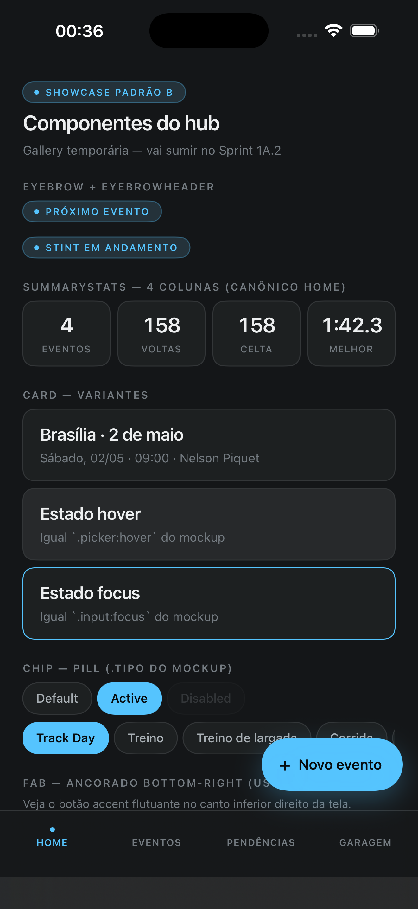
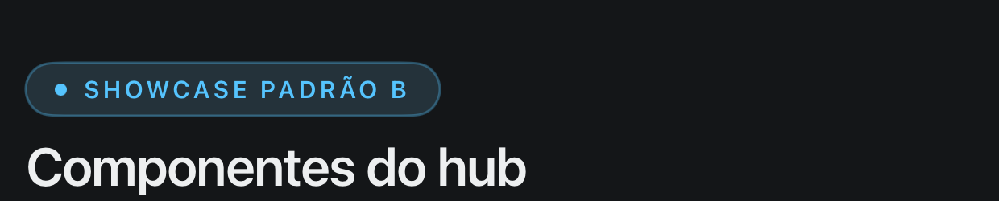
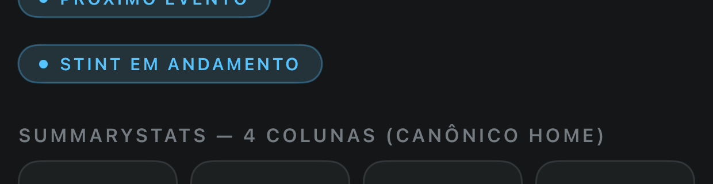
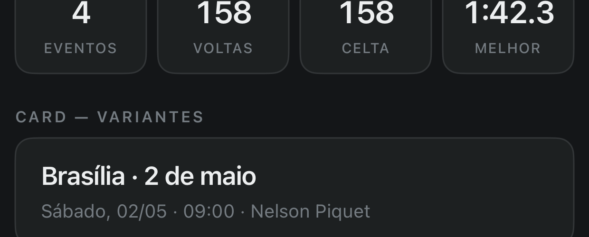
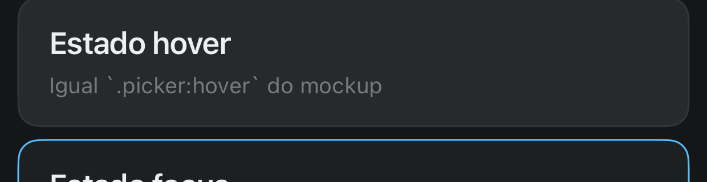
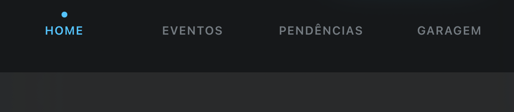
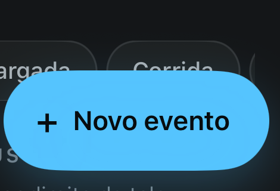

# Components — Padrão B SwiftUI

Conjunto base de componentes que cobrem os mockups do hub do P1 Fast em `_design-reference/`. Tokens visuais (cores OKLCH→sRGB, tipografia, espaçamento, raio) ficam em [`Sources/Theme/Theme.swift`](../Theme/Theme.swift).

**Canônico:** [`_design-reference/historico-evento/mockup-evento-B.html`](../../../../_design-reference/historico-evento/mockup-evento-B.html) + [`_design-reference/mockup-home-cheio.html`](../../../../_design-reference/mockup-home-cheio.html).
**Tokens-fonte:** [`docs/THEME_TOKENS.md`](../../../../docs/THEME_TOKENS.md) (10 OKLCH→sRGB pinados, validados por `node tests/node-smoke-oklch.mjs`).

Princípios inegociáveis aplicados em todos os componentes:
- Tratamento "você" — nunca "tu/te/ti/teu/tua".
- Sem ícones decorativos. Texto puro em todos os labels (o "+" do FAB e os "dots" são primitivos geométricos do canônico).
- Visual diff vs mockup-evento-B.html < 2%.

## Showcase

Tela [`ThemeShowcaseView`](../Views/ThemeShowcaseView.swift) renderiza todos os componentes em estados-chave. É a `body` do app enquanto `database.status == .ok`. Vai sumir quando `HomeView`/`EventosView` aterrissarem (Prompts #8-#10).



## Componentes

### Eyebrow + EyebrowHeader



- `Eyebrow(text:)` — pill uppercase 10pt + dot accent. Background `accentDim @0.15`, border `accent @0.35`. Espelha `.eyebrow` do mockup.
- `EyebrowHeader(eyebrow:title:subtitle:)` — combina kicker + título 22pt + subtítulo 13pt textFaint. Padrão de abertura de tela ou de seção principal de card.

### SummaryStats



- `SummaryStats([StatItem])` — grid horizontal de stats. Cada cell é `surfaceRaised + border md + valor 22pt tabular-nums + label 10pt uppercase tracking 0.06em`. Espelha `.gauges` do mockup-home-cheio.
- 4 colunas é o canônico (Eventos / Voltas / Carro / Melhor). 3 colunas é variante aceita.

### Card



- `Card(style:content:)` — container neutro `surfaceRaised + border + radius md + padding 18×16`.
- Variantes: `.raised` (default — `.card` do mockup), `.hover` (`surfaceHover` — equivalente ao `.picker:hover`), `.accent` (border `accent` — `.input:focus`).
- Conteúdo livre via `@ViewBuilder`. Tap feedback canônico vem de elementos internos (Chip/FAB), não do próprio Card.

### Chip



- `Chip(_:isActive:isDisabled:action:)` — pill 13pt medium. Espelha `.tipo` do mockup-evento-B.html.
- Estados: default (`surfaceRaised + border + textMuted`), active (`accent bg + onAccent text + semibold`), disabled (`opacity 0.4`), pressed (`scaleEffect 0.97` durante o gesto, igual `.btn:active`).
- `FlowChipRail(items:active:)` é helper de preview que monta um rail horizontal scrollable, equivalente ao `.tipo-rail`.

### BottomNav



- `BottomNav(items:selection:onSelect:)` — barra inferior fixa, dot accent acima do label do item ativo (não ícone). Background `surface @0.92` com `.ultraThinMaterial` (equivalente ao `backdrop-filter: blur(20px) saturate(140%)` do mockup).
- Itens canônicos do hub: Home / Eventos / Pendências / Garagem.
- Texto puro 10pt uppercase tracking 0.06em — igual `.bottom-nav__item` do mockup.

### FAB



- `FAB(_:isDisabled:action:)` — floating action button. Pill `accent` com `+` antes do label, height 56, padding 18 esquerda / 22 direita, sombra `accent @0.25 r=14 y=10` igual o `box-shadow` do mockup.
- O `+` é primitivo geométrico (sinal de soma renderizado como caractere), não ícone — está no canônico CSS.
- Posicionamento: o componente é só um `View` retangular. Quem usa ancora via `.overlay(alignment: .bottomTrailing)` + padding (canônico mockup: `bottom: 90; right: 16`).

## Como rodar a showcase

```bash
cd ios/p1fast-ios
xcodegen --spec project.yml   # se mexeu em sources
xcodebuild -project p1fast-ios.xcodeproj \
           -scheme p1fast-ios \
           -configuration Debug \
           -sdk iphonesimulator \
           -destination 'platform=iOS Simulator,name=iPhone 17 Pro' \
           -derivedDataPath /tmp/p1fast-derived build

DEVICE=$(xcrun simctl list devices booted | awk -F'[()]' '/Booted/{print $2; exit}')
xcrun simctl install "$DEVICE" /tmp/p1fast-derived/Build/Products/Debug-iphonesimulator/p1fast-ios.app
xcrun simctl launch "$DEVICE" com.flaviomarques.p1fast
xcrun simctl io "$DEVICE" screenshot showcase.png
```

Cada componente também tem `#Preview` próprio dentro do arquivo — abrindo no Xcode você vê todos os estados (default/active/hover/pressed/disabled) sem precisar rodar simulator.

## Convenções

- Animações usam `Layout.snap` (spring suave) — equivalente ao `cubic-bezier(.34,1.56,.64,1)` do mockup.
- Pressed feedback via `simultaneousGesture(DragGesture(minimumDistance: 0))` para reagir antes do botão completar.
- Preview com `.preferredColorScheme(.dark)` — todos os mockups Padrão B são single-mode dark.
- `.frame(maxWidth: .infinity)` quando o componente preenche linha (cards, summarystats); largura intrínseca em pills (eyebrow, chip, fab).

## Próximas pedras (Sprint 1A.2)

- Prompt #8 — `HomeView` cheio + vazio (usa Eyebrow, SummaryStats, Card, Chip, BottomNav, FAB).
- Prompt #9 — Garagem + modais (mesmos componentes, novo arranjo).
- Prompt #10 — Eventos lista + detalhe.

Quando essas telas chegarem, a `ThemeShowcaseView` é removida e os componentes passam a viver só em uso real + Previews.
